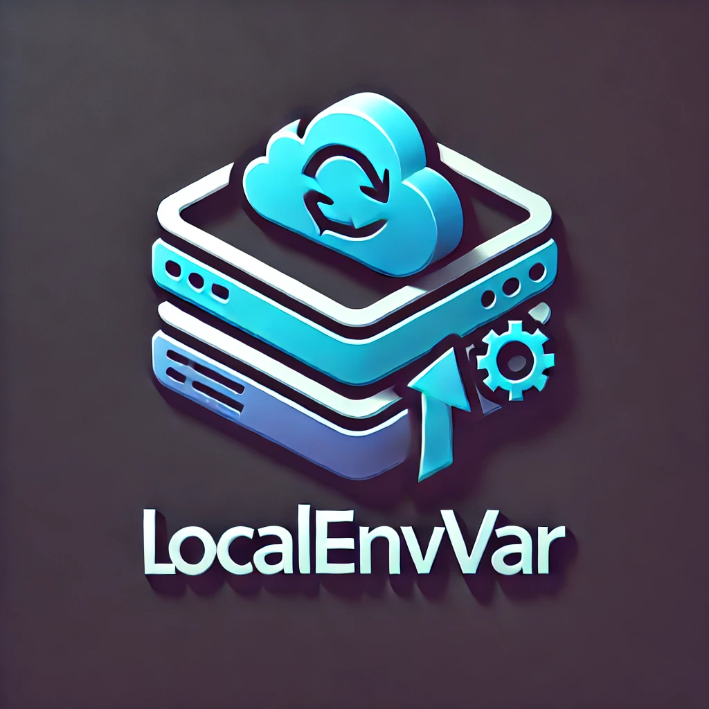

<a id="readme-top"></a>

[![Contributors][contributors-shield]][contributors-url]
[![Forks][forks-shield]][forks-url]
[![Stargazers][stars-shield]][stars-url]
[![Issues][issues-shield]][issues-url]
[![project_license][license-shield]][license-url]
[![LinkedIn][linkedin-shield]][linkedin-url]

<br />

<div align="center">
  <a href="https://github.com/stefan-karlsson/LocalEnvVar">
    
  </a>

<h3 align="center">LocalEnvVar</h3>

  <p align="center">
    Easily map your local environment variables from any source.
    <br />
    <a href="https://github.com/stefan-karlsson/LocalEnvVar"><strong>Explore the docs »</strong></a>
    <br />
    &middot;
    <a href="https://github.com/stefan-karlsson/LocalEnvVar/issues/new?labels=bug&template=bug-report---.md">Report Bug</a>
    &middot;
    <a href="https://github.com/stefan-karlsson/LocalEnvVar/issues/new?labels=enhancement&template=feature-request---.md">Request Feature</a>
  </p>
</div>

<details>
  <summary>Table of Contents</summary>
  <ol>
    <li>
      <a href="#about-the-library">About The Library</a>
      <ul>
        <li><a href="#built-with">Built With</a></li>
      </ul>
    </li>
    <li>
      <a href="#getting-started">Getting Started</a>
      <ul>
        <li><a href="#prerequisites">Prerequisites</a></li>
        <li><a href="#installation">Installation</a></li>
      </ul>
    </li>
    <li><a href="#usage">Usage</a></li>
    <li><a href="#contributing">Contributing</a></li>
    <li><a href="#license">License</a></li>
    <li><a href="#contact">Contact</a></li>
  </ol>
</details>

## About The Library

LocalEnvVar is a lightweight .NET library that simplifies local development by letting you easily map environment variables from any source to your local environment. It’s built with extensibility in mind—while it currently supports a single source, additional sources will be added in future releases.

<p align="right">(<a href="#readme-top">back to top</a>)</p>

### Built With

[![Dotnet 9][Dotnet]][Dotnet-url]

<p align="right">(<a href="#readme-top">back to top</a>)</p>

## Getting Started

### Prerequisites

* .NET 9 SDK

### Installation

LocalEnvVar is available as NuGet packages. You can install the library using the following methods:

#### Using .NET CLI

```sh
# Install core package for basic environment variable handling
dotnet add package LocalEnvVar.Core

# Install AWS Lambda package that provider environment variables from AWS Lambda.
dotnet add package LocalEnvVar.Aws.Lambda
```

#### Using Package Manager Console

```powershell
# Install core package
Install-Package LocalEnvVar.Core

# Install AWS Lambda package
Install-Package LocalEnvVar.Aws.Lambda
```

<p align="right">(<a href="#readme-top">back to top</a>)</p>

<!-- USAGE EXAMPLES -->
## Usage

```csharp
using LocalEnvVar.Aws.Lambda;
using LocalEnvVar.Core;

await EnvVar.MapToLocal(
    new LambdaEnvProvider("my-fancy-LambdaFunction-TYWXBqyYkkCM")
);

// All environment variables are now available for use in your local environment
```

<p align="right">(<a href="#readme-top">back to top</a>)</p>

## Contributing

We appreciate and welcome contributions from the community! Before you get started, please take a moment to review our [CONTRIBUTING.md](CONTRIBUTING.md) file, which includes:

- Code of Conduct
- Development setup guide
- Workflow for submitting pull requests

For any substantial changes, please open an issue first to discuss what you would like to change. This helps ensure your time is well spent and that your contributions align with the project's direction.

Quick start:
1. Fork the repository
2. Create your feature branch (`git checkout -b feature/AmazingFeature`)
3. Commit your changes (`git commit -m 'Add some AmazingFeature'`)
4. Push to the branch (`git push origin feature/AmazingFeature`)
5. Open a Pull Request

Make sure to:
- Follow the existing code style
- Add/update tests as needed
- Update documentation to reflect your changes
- Include a clear description of your changes in your PR

Thank you for helping make LocalEnvVar better! 🚀

<p align="right">(<a href="#readme-top">back to top</a>)</p>

### Top contributors:

<a href="https://github.com/stefan-karlsson/LocalEnvVar/graphs/contributors">
  
</a>

<!-- LICENSE -->
## License

Distributed under the MIT license. See [`LICENSE`](LICENSE) for more information.

<p align="right">(<a href="#readme-top">back to top</a>)</p>

<!-- CONTACT -->
## Contact

Stefan Karlsson - iam@stefan-karlsson.se

Project Link: [https://github.com/stefan-karlsson/LocalEnvVar](https://github.com/stefan-karlsson/LocalEnvVar)

<p align="right">(<a href="#readme-top">back to top</a>)</p>

<!-- MARKDOWN LINKS & IMAGES -->
<!-- https://www.markdownguide.org/basic-syntax/#reference-style-links -->
[contributors-shield]: https://img.shields.io/github/contributors/stefan-karlsson/LocalEnvVar.svg?style=for-the-badge
[contributors-url]: https://github.com/stefan-karlsson/LocalEnvVar/graphs/contributors
[forks-shield]: https://img.shields.io/github/forks/stefan-karlsson/LocalEnvVar.svg?style=for-the-badge
[forks-url]: https://github.com/stefan-karlsson/LocalEnvVar/network/members
[stars-shield]: https://img.shields.io/github/stars/stefan-karlsson/LocalEnvVar.svg?style=for-the-badge
[stars-url]: https://github.com/stefan-karlsson/LocalEnvVar/stargazers
[issues-shield]: https://img.shields.io/github/issues/stefan-karlsson/LocalEnvVar.svg?style=for-the-badge
[issues-url]: https://github.com/stefan-karlsson/LocalEnvVar/issues
[license-shield]: https://img.shields.io/github/license/stefan-karlsson/LocalEnvVar.svg?style=for-the-badge
[license-url]: https://github.com/stefan-karlsson/LocalEnvVar/blob/main/LICENSE.txt
[linkedin-shield]: https://img.shields.io/badge/-LinkedIn-black.svg?style=for-the-badge&logo=linkedin&colorB=555
[linkedin-url]: https://linkedin.com/in/stekar
[Dotnet]: https://img.shields.io/badge/dotnet-000000?style=for-the-badge&logo=dotnet&logoColor=white
[Dotnet-url]: https://dotnet.microsoft.com
